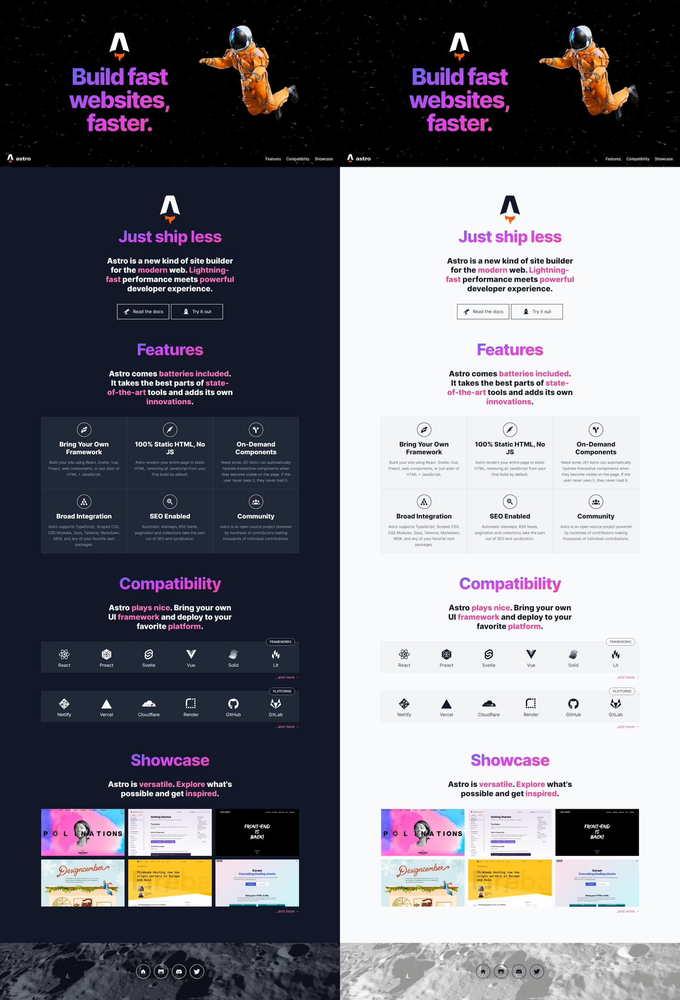

[](https://astro.build)

# Astro Landing Page

> An Astro + Tailwind CSS example/template for landing pages.



## Features

- 💨 Tailwind CSS for styling
- 🎨 Themeable
  - CSS variables are defined in `src/styles/theme.css` and mapped to Tailwind classes (`tailwind.config.cjs`)
- 🌙 Dark mode
- 📱 Responsive (layout, images, typography)
- ♿ Accessible (as measured by https://web.dev/measure/)
- 🔎 SEO-enabled (as measured by https://web.dev/measure/)
- 🔗 Open Graph tags for social media sharing
- 💅 [Prettier](https://prettier.io/) setup for both [Astro](https://github.com/withastro/prettier-plugin-astro) and [Tailwind](https://github.com/tailwindlabs/prettier-plugin-tailwindcss)

## Commands

| Command                | Action                                             |
| :--------------------- | :------------------------------------------------- |
| `npm install`          | Install dependencies                               |
| `npm run dev`          | Start local dev server at `localhost:3000`         |
| `npm run build`        | Build your production site to `./dist/`            |
| `npm run preview`      | Preview your build locally, before deploying       |
| `npm run astro ...`    | Run CLI commands like `astro add`, `astro preview` |
| `npm run astro --help` | Get help using the Astro CLI                       |
| `npm run format`       | Format code with [Prettier](https://prettier.io/)  |
| `npm run clean`        | Remove `node_modules` and build output             |

## Testing

We have four levels of tests in this repo. The first three run in CI on every push with zero secrets.

| Level | What is mocked | Command |
| --- | --- | --- |
| Unit (vitest) | everything outside the function | `npm test` |
| Browser (Playwright) | everything server-side | `npx playwright test --project=browser` |
| Integration (Playwright) | external dependencies (Nayax/Sheets, via `tests/e2e/fixture-server.mjs`) | `npx playwright test --project=integration` |
| Smoke | nothing | `npm run smoke` (manual only, see below) |

### Live smoke test

The smoke exists for one question: is the slot table the restocker sees derived correctly from the Production Plan and Inventory, after passing through the real backend? It runs against the live site (or a deploy preview), reads the actual Google Sheets independently, and asserts per drink that the plan amounts equal what the table tells the restocker to load (Load days), or that topoff amounts never exceed cold storage (Topoff days). It saves `smoke-table.png` for eyeballing every run.

```
RESTOCK_SECRET_KEY=... \
SMOKE_DATE=2026-09-08 \
GOOGLE_SERVICE_ACCOUNT_EMAIL=... GOOGLE_PRIVATE_KEY=... \
PRODUCTION_PLAN_SHEET_ID=... RESTOCK_LOG_SHEET_ID=... INVENTORY_SHEET_ID=... \
npm run smoke
```

Optional: `SMOKE_URL=https://deploy-preview-NN--orble-tea.netlify.app` to target a preview, `SMOKE_MACHINE` (default 30TH), `GOOGLE_SHEETS_ACCESS_TOKEN` instead of the service account pair.

Rules the smoke lives by:

- **Not in CI, on purpose.** It depends on live third parties and real data, and is run by a human who knows what the sheets say today. Run it before merging risky changes, after Netlify env changes, or when the machine misbehaves and you want to rule out software in one command.
- **Read-only.** It never taps Complete. Once the real submit ships, Complete writes actual Restock Log rows and Nayax updates.
- **Independent derivation.** `tests/smoke/smoke.spec.js` must never import from `src/lib/restock`. Its expectations are computed naively from raw sheet values; reusing the backend's own code would let a derivation bug agree with itself and pass.
- **Aggregate-level.** It checks that no unit of any drink is lost or invented end to end. Slot-level placement is covered by the fixture-backed browser tests.

## Credits

- astronaut image
  - source: https://github.com/withastro/astro-og-image; note: this repo is not available anymore
- moon image
  - source: https://unsplash.com/@nasa
- other than that, a lot of material (showcase data, copy) was taken from official Astro sources, in particular https://astro.build/blog/introducing-astro/ and https://github.com/withastro/astro.build
