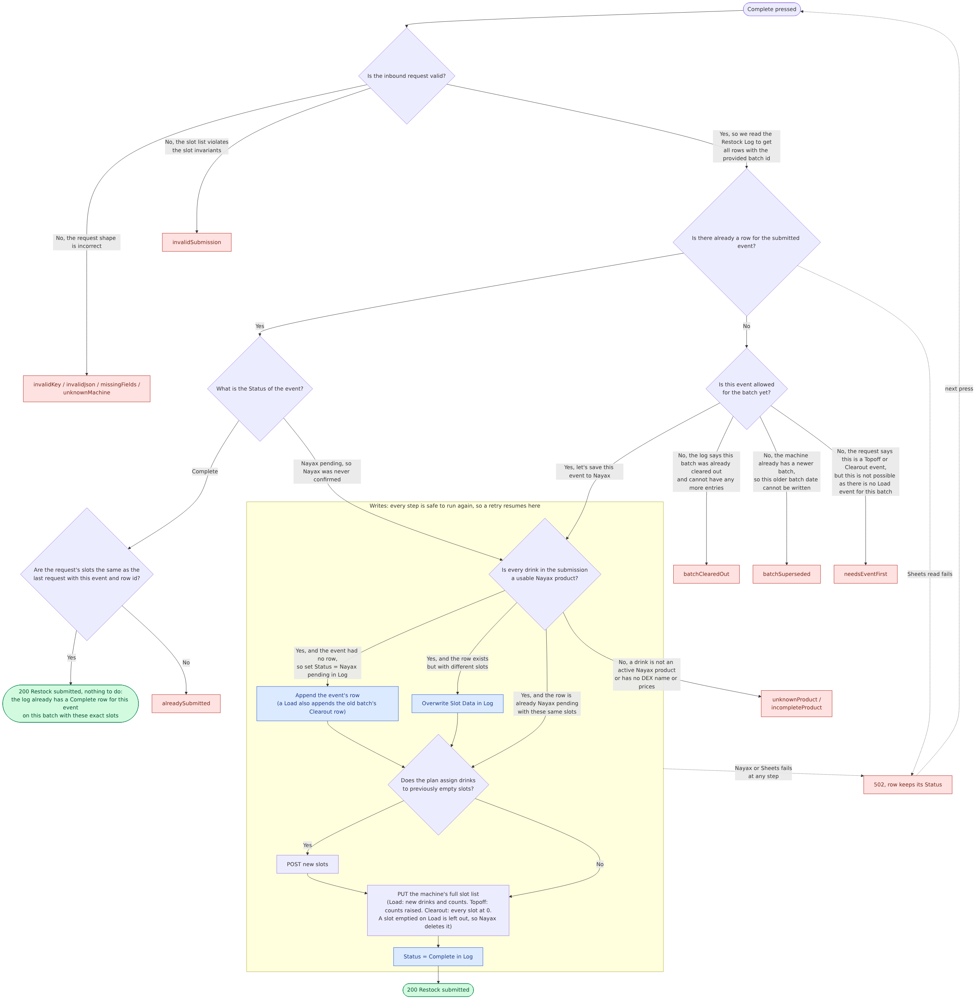
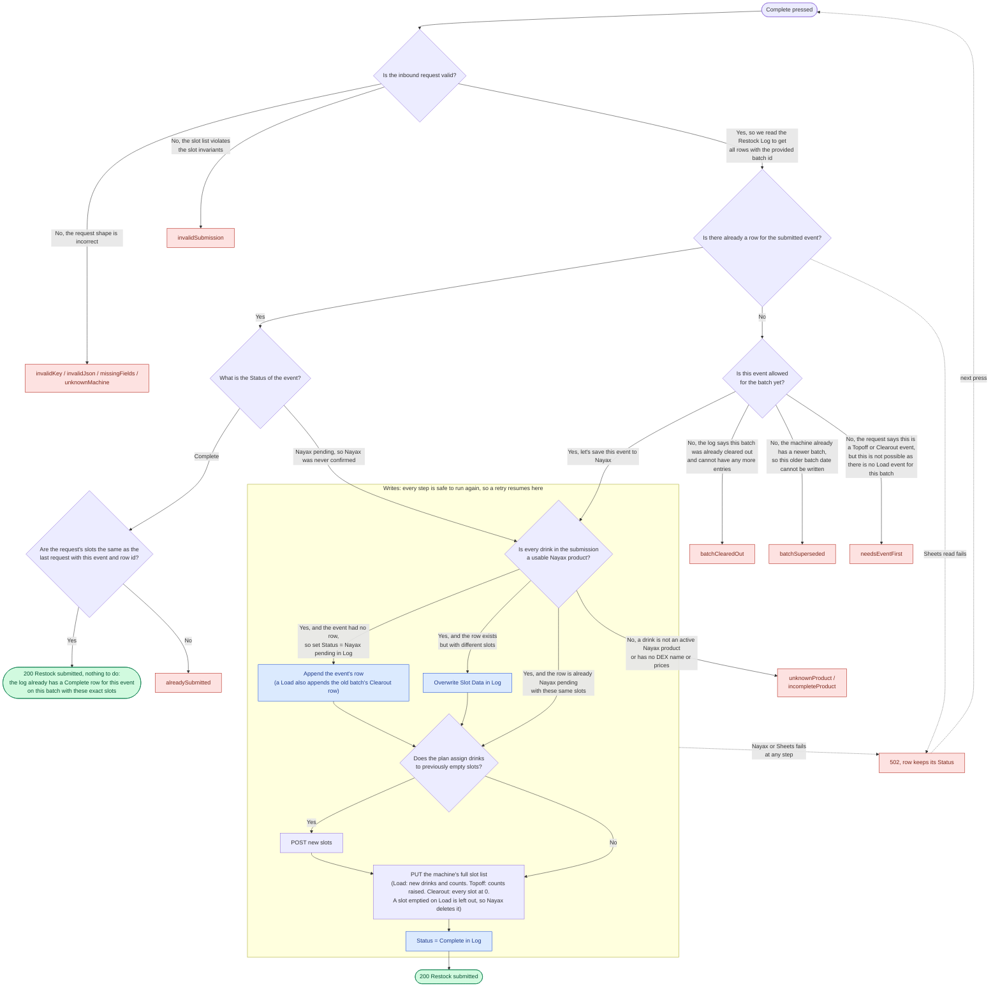

# Restock submit

Mermaid source (render with mermaid@11 to regenerate the PNG)

```mermaid
%%{init: {"flowchart": {"rankSpacing": 35, "nodeSpacing": 40, "wrappingWidth": 360}}}%%
flowchart TD
  A([Complete pressed]) --> Q1{Is the inbound request valid?}
  Q1 -- "No, the request shape is incorrect" --> R0["invalidKey / invalidJson / missingFields /<br/>unknownMachine"]
  Q1 -- "No, the slot list violates<br/>the slot invariants" --> R1[invalidSubmission]
  Q1 -- "Yes, so we read the Restock Log to get<br/>all rows with the provided batch id" --> Q2{"Is there already a row for the submitted event?"}
  Q2 -- Yes --> ST{"What is the Status of the event?"}
  Q2 -- No --> Q2b{"Is this event allowed<br/>for the batch yet?"}

  ST -- Complete --> SSC{"Are the request's slots the same as the<br/>last request with this event and row id?"}
  R0 ~~~ SSC
  ST -- "Nayax pending, so Nayax was never confirmed" --> Q3

  SSC -- Yes --> OK0(["200 Restock submitted, nothing to do:<br/>the log already has a Complete row for this event<br/>on this batch with these exact slots"])
  SSC -- No --> R5[alreadySubmitted]

  Q2b -- "Yes, let's save this event to Nayax" --> Q3
  Q2b -- "No, the log says this batch was already cleared out<br/>and cannot have any more entries" --> R2[batchClearedOut]
  Q2b -- "No, the machine already has a newer batch,<br/>so this older batch date cannot be written" --> R7[batchSuperseded]
  Q2b -- "No, the request says this is a Topoff or Clearout event,<br/>but this is not possible as there is no Load event for this batch" --> R4[needsEventFirst]

  subgraph W [Writes: every step is safe to run again, so a retry resumes here]
  Q3{"Is every drink in the submission<br/>a usable Nayax product?"}
  Q3 -- "Yes, and the event had no row,<br/>so set Status = Nayax pending in Log" --> E1["Append the event's row<br/>(a Load also appends the old batch's Clearout row)"]
  Q3 -- "Yes, and the row exists<br/>but with different slots" --> E2[Overwrite Slot Data in Log]
  Q3 -- "Yes, and the row is already Nayax pending<br/>with these same slots" --> Q4
  E1 --> Q4
  E2 --> Q4

  Q4{"Does the plan assign drinks<br/>to previously empty slots?"}
  Q4 -- Yes --> P[POST new slots]
  Q4 -- No --> N
  P --> N
  N["PUT the machine's full slot list<br/>(Load: new drinks and counts. Topoff: counts raised. Clearout: every slot at 0.<br/>A slot emptied on Load is left out, so Nayax deletes it)"]
  N --> G[Status = Complete in Log]
  end
  Q3 -- "No, a drink is not an active Nayax product<br/>or has no DEX name or prices" --> R6["unknownProduct /<br/>incompleteProduct"]
  G --> OK([200 Restock submitted])

  Q2 -. "Sheets read fails" .-> X[502, row keeps its Status]
  R6 ~~~ X
  W -. "Nayax or Sheets fails<br/>at any step" .-> X
  X -. "next press" .-> A

  classDef reject fill:#fde2e1,stroke:#b42318,color:#7a271a
  classDef ok fill:#d1fadf,stroke:#027a48,color:#054f31
  class R0,R1,R2,R4,R5,R6,R7,X reject
  class OK,OK0 ok
  classDef log fill:#dbeafe,stroke:#1d4ed8,color:#1e3a8a
  class E1,E2,G log
```

