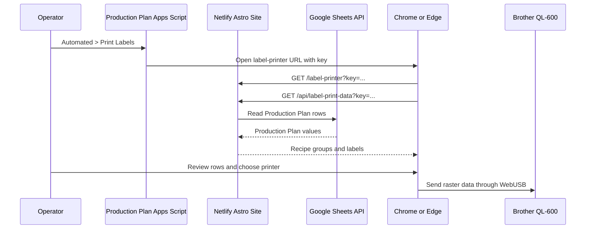

# Production Label Printing

This feature lets a production operator print labels directly from the Production Plan. The operator opens the hosted label-printer page, reviews the labels generated from the plan, connects the Brother QL-600 through the browser, and prints the selected rows.

The goal is to keep the Production Plan as the source of truth and let any authorized operator print from the browser on the computer connected to the printer. The only local requirement is Chrome or Edge on that computer.

## Communication Flow



## Services And Responsibilities

`Production Plan Apps Script` adds a menu item and opens the hosted label-printer page. This is a one-time spreadsheet setup.

`Netlify Astro site` serves the printer UI and exposes `/api/label-print-data`. The API validates the shared restock key before reading Google Sheets.

`Google Sheets API` provides the Production Plan rows. The label printer reuses the same sheet-loading helpers as the restock workflow.

`Chrome or Edge WebUSB` asks the operator for permission to access the locally connected QL-600, then sends the raster print job to the printer.

`Brother QL-600` receives Brother raster commands for DK-1204 labels.

## Production Plan Inputs

The label API reads these Production Plan fields:

- `Recipe`
- `Drink Variation`
- `Amount to Make`
- `Amount to 30TH`
- `Slot (30TH)`
- `Amount to Towne`
- `Slot (Towne)`
- `Date`, when present

Machine columns come from `MACHINE_CONFIG` in `src/lib/restock/config.js`, so new machine labels should be added there instead of adding another label-specific mapping.

## Label Output

Each label contains:

- Full drink variation name
- Expiration date
- Optional machine and slot code

The expiration date is the production date plus seven days. If the Production Plan does not provide a `Date` value, the API uses the current New York date before adding seven days.

Machine labels receive a code in the top-left corner:

- `30TH#<slot>` for 30th
- `TWNE#<slot>` for Towne

Storage labels leave the top-left corner blank.

For each Production Plan row, total labels come from `Amount to Make`. Machine labels are generated from the machine amount and slot columns. Any remaining labels become storage labels.

## Printing Behavior

Rows are grouped by recipe. When the operator prints selected rows, the browser sends one print job per recipe group so the QL-600 cuts only after that recipe's labels.

The page starts with every row selected. Operators can clear the top checkbox or uncheck individual drink variations before printing.

## Changing Label Behavior

Update label data rules in:

```text
src/lib/label-printer/production-plan.js
```

Update visual label layout and raster generation in:

```text
src/lib/label-printer/raster.js
```

Update browser connection behavior in:

```text
src/lib/label-printer/webusb.js
```

Update the printer dialog UI in:

```text
src/components/label-printer/LabelPrinterShell.astro
```

To support a new printer, the browser must be able to claim the USB device through WebUSB, and the printer must accept raster commands that the app can generate. A printer with a different command language or label geometry will need a new raster module.

## One-Time Apps Script Setup

These steps have already been taken. The steps are firstly to copy `label-printing/apps_script_webusb_integration.js` into the Production Plan Apps Script project.

Then, we set these Apps Script project properties:

```text
LABEL_PRINTER_URL=https://YOUR_NETLIFY_DEPLOY/label-printer
LABEL_PRINTER_KEY=YOUR_RESTOCK_KEY
```

Then add the menu item to the existing `onOpen()` menu:

```js
.addItem('Print Labels', 'openLabelPrinter')
```

The existing `runEverything()` flow can also show the printer link after recipe cards and inventory finish:

```js
done.innerHTML += labelPrinterLinkHtml_();
```

## Operator Runbook

1. Plug the Brother QL-600 into the computer by USB.
2. Open the label printer page from the Production Plan menu.
3. Use Chrome or Edge.
4. Review the label table.
5. Uncheck any rows that should not print.
6. Click `Connect QL-600` if the printer is not already connected.
7. Choose the QL-600 in the browser permission picker.
8. Click `Print Everything`.

The browser remembers the printer permission for the site. On later visits, the page tries to reconnect automatically.

## Local Development

Run the site locally:

```sh
npm run dev
```

Open:

```text
http://localhost:4321/label-printer?key=YOUR_RESTOCK_KEY
```

The local page still requires the shared restock key. WebUSB works on `localhost` for development and requires HTTPS when hosted.
